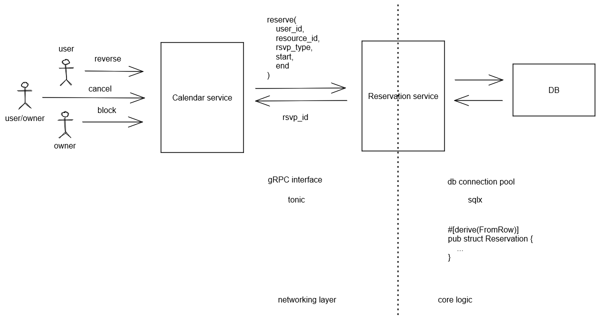

# Core Reservation

- Feature Name: core-reservation
- Start Date: 2022-10-28

## Summary

A core reservation service that solves the problem of reserving a resource for a period of time. We leverage postgres EXECUTE constraints to ensure that only one reservation can be made for a given resource at a given time.

## Motivation

We need a common solution for various reservation requrement: 1) calendar booking; 2) hotel/room booking; 3) meeting room booking; 4) parking lot booking; 5) etc. Repeatedly building features for these requrements is a waste of time and resource. We should have a common solution that can be used by all teams.

## Guide-level explanation

Basic architecture:



### Service interface

We should use gRPC  as a service interface. Below is the proto defition:

```protobuf
enum ResercationStatus {
    UNKNOWN = 0;
    PENDIGN = 1;
    CONFIRMED = 2;
    BLOCKED = 3;
}

message Reservation {
    string id = 1;
    string resource_id = 2;
    ResercationStatus status = 3;

    // resource reservation window
    string user_id = 4;
    goolge.protobuf.Timestamp start_time = 5;
    goolge.protobuf.Timestamp end_time = 6;
    
    // extra note
    string note = 7;
}

message ReserveRequest {
    Reservation reservation = 1;
}

message ReserveResponse {
    Reservation reservation = 1;
}

message UpdateRequest {
    Reservation reservation = 1;
    string note = 2;
}

message UpdateResponse {
    Reservation reservation = 1;
}

message ConfirmRequest {
    string id = 1;
}

message ConfirmResponse {
    Reservation reservation = 1;
}

message CancelRequest {
    string id = 1;
}

message CancelResponse {
    Reservation reservation = 1;
}

message GetRequest {
    string id = 1;
}

message GetResponse {
    Reservation reservation = 1;
}

message QueryRequest {
    string resource_id = 1;
    string user_id = 2;
    // use status to filter result. If UNKNOWN, return all reservation
    ReservationStatus status = 3;
    google.protobuf.Timestamp start = 4;
    google.protobuf.Timestamp end = 5;
}

service ReservationService {
    rpc reserve(ReserveResponse) retures (ReserveResponse);
    rpc confirm(ConfirmRequest) retures (ConfirmResponse);
    rpc update(UpdateRequest) retures (UpdateResponse);
    rpc cancel(CancelRequest) retures (CancelResponse);    
    rpc get(GetRequest) retures (GetResponse);
    rpc query(QueryRequest) retures (stream Reservation);
}
```

### Database schema

We use postgres as the database. Below is the schema

```postgresql
CREATE SCHEMA rsvp;
CREATE TYPE rsvp.reservation_status AS ENUM ('unknown', 'pending', 'confirmed', 'blocked');

CREATE TABLE revp.reservation (
    id uuid NOT NULL DEFAULT uuid_generate_v4(),
    user_id VARCHAR(64) NOT NULL,
    status rsvp.reservation_status NOT NULL DEFAULT 'pending',

    resouce_id VARCHAR(64) NOT NULL,
    timespan TSTZRANGE NOT NULL,

    note text,

    CONSTRAINT reservations_pkey PRIMARY KEY (id),
    CONSTRAINT reservations_conflict EXCLUDE USING gist (reservation_id WITH =, timespan WITH &&)
);
CREATE INDEX reservations_resource_id_idx ON rsvp.reservations (resource_id);
CREATE INDEX reservations_user_id_idx ON rsvp.reservations (user_id);

-- if user_id is null, find all reservations within during for the resource
-- if resource_id is null, find all reservations within during for the user
-- if both are null, find all reservations within during
-- if both set, find all reservations within during for the resource and user
CREATE OR REPLACE FUNCTION rsvp.query(uid text, rid text, during: TSTZRANGE) RETURNS TABLE rsvp.reservations AS $$ $$ LANGUAGE plpgsql;

-- resevation change queue
CREATE TABLE rsvp.reservation_changes (
    id SERIAL NOT NULL,
    reservation_id uuid NOT NULL,
    op rsvp.reservation_update_type NOT NULL,
);

-- trigger for add/update/delete a reservation
CREATE OR REPLACE FUNCTION rsvp.reservations_trigger() RETURNS TRIGGER AS $$
BEGIN
    IF TG_OP = 'INSERT' THEN
        -- update reservation_changes
        INSERT INTO rsvp.reservation_changes (reservation_id, op) VALUES (NEW.id, 'create');
    ELSIF TG_OP = 'UPDATE' THEN
        -- if status changed, update reservation_changes
        IF OLD.status <> NEW.status THEN
            INSERT INTO rsvp.reservation_changes (reservation_id, op) VALUES (NEW.id, 'update');
        END IF;
    ELSIF TG_OP = 'DELETE' THEN
        -- update reservation_changes
        INSERT INTO rsvp.reservation_changes (reservation_id, op) VALUES (OLD.id, 'delete');
    END IF;
    -- notify a channel called reservation_update
    NOTIFY reservation_update;
    RETURN NULL;
END;
$$ LANGUAGE plpgsql;

CREATE TRIGGER reservations_trigger
    AFTER INSERT OR UPDATE OR DELETE ON rsvp.reservations
    FOR EACH ROW EXECUTE PROCEDURE rsvp.reservations_trigger();
```
